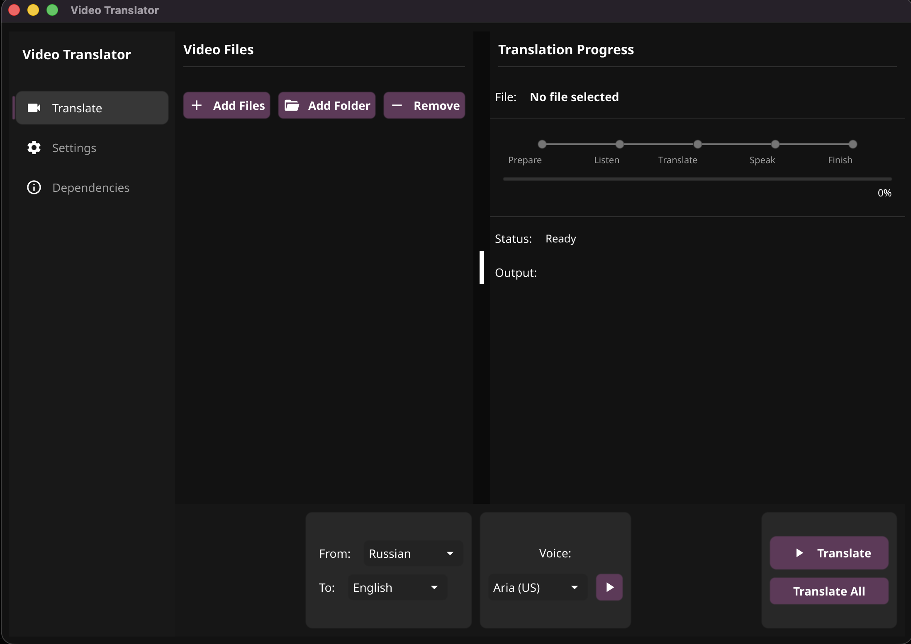

# Video Translator

A native macOS desktop application for translating and dubbing videos. Supports multiple transcription, translation, and text-to-speech providers.



## Features

- **Video Translation** - Translate audio from any video file to another language
- **Multiple Providers** - Choose between local (free) or cloud-based services
- **Batch Processing** - Handle multiple videos simultaneously
- **Progress Tracking** - Real-time progress with 5 stages: Prepare → Listen → Translate → Speak → Finish
- **Background Audio Mixing** - Preserve original music/ambient sounds
- **SRT Export** - Generate subtitle files alongside dubbed video

## Requirements

### macOS (Apple Silicon Recommended)

#### Required Dependencies

```bash
# FFmpeg (required)
brew install ffmpeg

# Transcription - WhisperKit (recommended for Apple Silicon)
brew install whisperkit-cli
```

#### Optional Dependencies

**Alternative Transcription:**
```bash
# Whisper.cpp
brew install whisper-cpp

# Faster Whisper (Python)
pip install faster-whisper
```

**Translation:**
```bash
# Argos Translate (free, local)
pip install argostranslate
```

**Text-to-Speech:**
```bash
# Piper TTS (free, local)
pip install piper-tts

# Edge TTS (free, Microsoft neural voices)
pip install edge-tts
```

### Cloud Services (Optional)

For cloud-based providers, you'll need API keys:
- **OpenAI** - Translation & TTS
- **DeepSeek** - Translation (10x cheaper than GPT-4)
- **Groq** - Ultra-fast transcription

## Installation

### From Release (Recommended)

1. Download the latest `.app` from [Releases](https://github.com/anilpdv/video-dubber/releases)
2. Move to Applications folder
3. Open and allow in System Preferences if prompted

### From Source

```bash
# Clone repository
git clone https://github.com/anilpdv/video-dubber.git
cd video-dubber

# Install Go dependencies
go mod download

# Run directly
go run main.go

# Or build the app
fyne package -os darwin
```

## Usage

1. **Add Files** - Click "Add Files" or "Add Folder" to select videos
2. **Configure** - Set source/target language and voice in bottom panel
3. **Translate** - Click "Translate" for single file or "Translate All" for batch

### Settings

- **Transcription Provider** - WhisperKit (default), Whisper.cpp, Faster Whisper, or Groq
- **Translation Provider** - Argos (default), OpenAI, or DeepSeek
- **TTS Provider** - Edge TTS (default), Piper, OpenAI, or CosyVoice
- **Output Directory** - Default: `~/Desktop/Translated/`

## Supported Languages

- English, Russian, German, French, Spanish, Italian, Portuguese
- Japanese, Korean, Chinese
- And many more via provider-specific support

## Build

```bash
# macOS Apple Silicon
fyne package -os darwin -arch arm64

# macOS Intel
fyne package -os darwin -arch amd64

# Create DMG (optional)
create-dmg "Video Translator.app"
```

## License

MIT
